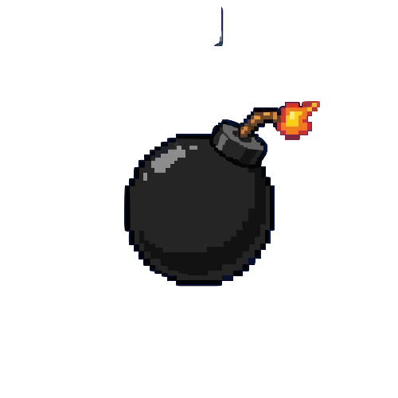

<p align="center">
  
</p>

<h1 align="center">DEADMINT</h1>

<p align="center">
  <strong>Wager SOL. Destroy blocks. Collect loot. Bomb your opponents.</strong><br/>
  <em>Last one standing wins the pot.</em>
</p>

<p align="center">
  
  
  
  
  
  
</p>

---

Deadmint is a fully on-chain Bomberman arena built on Solana. Players deposit SOL to enter, navigate a destructible grid, collect loot dropped from blocks, grab powerups, and place bombs to eliminate opponents. Every single move, bomb placement, and detonation is a verified transaction on-chain — no hidden server logic, no trust assumptions. The game runs on [MagicBlock Ephemeral Rollups](https://docs.magicblock.gg) for sub-10ms transaction processing and gasless gameplay.

---

## How It Works

```
 1. CONNECT         2. JOIN ARENA        3. PLAY              4. COLLECT
┌──────────┐      ┌──────────────┐     ┌──────────────┐     ┌──────────────┐
│  Connect │      │  Pick a tier │     │  Move, bomb, │     │  Last player │
│  Phantom │─────▶│  Wager SOL   │────▶│  collect SOL │────▶│  standing    │
│  wallet  │      │  Enter arena │     │  grab powers │     │  claims pot  │
└──────────┘      └──────────────┘     └──────────────┘     └──────────────┘
```

You wager SOL to enter an arena. The wagers form the prize pool. Destroying blocks drops SOL loot from that pool. Killing an opponent transfers their collected SOL to you. When only one player remains, they claim the entire prize pool (minus a 3% platform fee). Every action — from moving one tile to detonating a bomb — is a signed Solana transaction processed by MagicBlock's Ephemeral Rollup.

---

## Architecture

```
┌─────────────────────────────────────────────────────────────────────┐
│                           FRONTEND                                   │
│              Next.js 16 · React 19 · Canvas Renderer                 │
│                                                                       │
│  ┌───────────┐  ┌───────────┐  ┌────────────┐  ┌────────────────┐  │
│  │  Wallet   │  │  Game     │  │   Canvas   │  │   Session      │  │
│  │  Adapter  │  │  State    │  │   Render   │  │   Keys         │  │
│  └─────┬─────┘  └─────┬─────┘  └────────────┘  └───────┬────────┘  │
│        │               │                                 │           │
└────────┼───────────────┼─────────────────────────────────┼───────────┘
         │               │                                 │
         │     ┌─────────▼──────────┐           ┌─────────▼─────────┐
         │     │  onAccountChange   │           │  sendRawTx        │
         │     │  (WebSocket sub)   │           │  (fire & forget)  │
         │     └─────────┬──────────┘           └─────────┬─────────┘
         │               │                                 │
┌────────┼───────────────┼─────────────────────────────────┼───────────┐
│        ▼               ▼                                 ▼           │
│               MAGICBLOCK EPHEMERAL ROLLUP                            │
│            Sub-10ms block time · Gasless TXs                         │
│                                                                       │
│    ┌─────────────┐  ┌─────────────┐  ┌──────────────────────────┐   │
│    │  Delegate   │  │  Execute    │  │  Commit & Undelegate     │   │
│    │  PDAs       │  │  Gameplay   │  │  (state → base layer)    │   │
│    └─────────────┘  └─────────────┘  └──────────────────────────┘   │
└───────────────────────────┬──────────────────────────────────────────┘
                            │
┌───────────────────────────▼──────────────────────────────────────────┐
│                       SOLANA (DEVNET)                                 │
│                                                                       │
│    ┌──────────────┐   ┌─────────────┐   ┌───────────────────────┐   │
│    │  Game PDA    │   │ Player PDAs │   │   SOL Vault (escrow)  │   │
│    │  grid, bombs │   │ pos, stats  │   │   wagers + prizes     │   │
│    └──────────────┘   └─────────────┘   └───────────────────────┘   │
└──────────────────────────────────────────────────────────────────────┘
         ▲                                                │
         │          ┌─────────────────────────┐           │
         └──────────│     BACKEND (CRANK)     │───────────┘
                    │   Bun · WebSocket       │
                    │   Auto-detonate bombs   │
                    │   Check game end        │
                    │   Manage delegation     │
                    └─────────────────────────┘
```

**Key design decisions:**

- **No backend in the player path.** Players send transactions directly to the Ephemeral Rollup and subscribe to account changes via WebSocket. The backend only exists to crank automated game logic (bomb detonation timers, game-end checks) and manage the delegation lifecycle.
- **ER-authoritative state.** The frontend never predicts or simulates game state. Every pixel on screen comes from on-chain data pushed by the ER subscription.
- **Session keys for gasless UX.** After the initial SOL wager, all gameplay transactions are signed by a session keypair — no wallet popups during gameplay.

---

## Game Flow

```
    LOBBY                      ACTIVE                        FINISHED
 ┌──────────┐   all joined  ┌───────────────┐   1 alive   ┌────────────┐
 │  Create  │──────────────▶│  Delegate to  │────────────▶│  Winner    │
 │  game    │               │  Ephemeral    │             │  claims    │
 │          │               │  Rollup       │             │  prize     │
 │  Join +  │               │               │             │            │
 │  wager   │               │  Move / Bomb  │             │ Undelegate │
 │  SOL     │               │  Loot / Power │             │ to base    │
 └──────────┘               └───────────────┘             └────────────┘
```

1. **Lobby** — A player creates a game, sets the entry fee and max players (2–4). Others join by depositing SOL. The game auto-starts when all slots fill.
2. **Active** — The backend delegates all game PDAs to MagicBlock's Ephemeral Rollup. Players move, place bombs, collect loot, and fight — all gasless on the ER. The backend cranks bomb detonation timers and end-game checks.
3. **Finished** — When one player remains, the game ends. State commits back to the base layer. The winner calls `claim_prize` to withdraw the entire prize pool.

---

## Features

- **Fully on-chain** — every move is a transaction. TX hashes appear as stacking toast notifications proving on-chain integrity
- **MagicBlock Ephemeral Rollups** — sub-10ms transaction processing, gasless during gameplay
- **Session keys** — sign once to enter, play without wallet popups
- **Real-time canvas rendering** — custom pixel-art tile engine at 60fps with visual lerp, screen shake, particles
- **Bomb mechanics** — fuse timers (~3s), 4-directional blast propagation, chain detonation
- **Loot & powerups** — bomb range+, extra bombs, speed boost from destroyed blocks
- **Prize pool economics** — wager in, winner takes all (3% platform fee)
- **13 visual themes** — from gothic purple to cyberpunk green, all driven by CSS custom properties
- **Responsive** — desktop canvas with mobile-friendly HUD layout

---

## Tech Stack

| Layer | Technology |
|:------|:-----------|
| **Smart Contract** | Rust, Anchor 0.32.1, `ephemeral-rollups-sdk` 0.6.5 |
| **Frontend** | Next.js 16, React 19, TypeScript 5, Tailwind CSS 4 |
| **Rendering** | HTML5 Canvas, custom pixel-art tile engine (48px tiles, 12x12 art grid) |
| **Backend** | Bun runtime, native WebSocket server, crank automation |
| **Wallet** | Solana Wallet Adapter (Phantom, Solflare) |
| **Notifications** | Sonner (stacking TX hash toasts) |
| **Infra** | MagicBlock ER (devnet), Helius RPC, Railway (backend), Vercel (frontend) |

---

## On-Chain Program

**Program ID:** `Hx7eQa2NhDDKiBThKyo4VNLnBi7pApQX9JZTsA5xBbdb`

### Instructions

| Instruction | Description |
|:------------|:------------|
| `initialize_game` | Create arena with Bomberman grid, set entry fee and max players |
| `join_game` | Deposit SOL, claim spawn position, auto-start when full |
| `move_player` | Move in 4 directions, pick up loot/powerups, die on explosions |
| `place_bomb` | Drop bomb at current position (limited by `max_bombs`) |
| `detonate_bomb` | Explode bomb after fuse expires — blast propagation, chain reactions |
| `check_game_end` | Crank: detect last-player-standing, set winner |
| `claim_prize` | Winner withdraws prize pool to their wallet |
| `delegate` / `undelegate` | Transfer PDA ownership to/from Ephemeral Rollup |

### Account Structure

```
Game PDA                              Player PDA
seeds: ["game", game_id]             seeds: ["player", game_pda, index]
┌─────────────────────────┐          ┌───────────────────────┐
│ game_id        u64      │          │ authority    Pubkey    │
│ grid_width     u8  (13) │          │ x, y         u8       │
│ grid_height    u8  (11) │          │ alive        bool     │
│ max_players    u8       │          │ collected_sol u64     │
│ entry_fee      u64      │          │ wager        u64      │
│ prize_pool     u64      │          │ bomb_range   u8       │
│ status         u8       │          │ max_bombs    u8       │
│ winner         Pubkey   │          │ active_bombs u8       │
│ cells          [u8;143] │          │ speed        u8       │
│ powerup_types  [u8;143] │          │ kills        u8       │
│ bombs       [BombSlot;12]│         │ input_nonce  u64      │
└─────────────────────────┘          └───────────────────────┘
```

---

## Grid & Mechanics

The arena is a 13x11 Bomberman grid. Borders are indestructible walls. Even-row, even-column intersections are permanent pillars. The rest is filled with destructible blocks (except spawn safe zones in the four corners).

```
  0  1  2  3  4  5  6  7  8  9 10 11 12
0 W  W  W  W  W  W  W  W  W  W  W  W  W
1 W  .  .  B  B  B  B  B  B  B  .  .  W     . = empty (spawn safe zone)
2 W  .  W  B  W  B  W  B  W  B  W  .  W     W = wall (indestructible)
3 W  B  B  B  B  B  B  B  B  B  B  B  W     B = block (destructible)
4 W  B  W  B  W  B  W  B  W  B  W  B  W
5 W  B  B  B  B  B  B  B  B  B  B  B  W     Spawns:
6 W  B  W  B  W  B  W  B  W  B  W  B  W       P1 (1,1)   P2 (11,1)
7 W  B  B  B  B  B  B  B  B  B  B  B  W       P3 (1,9)   P4 (11,9)
8 W  .  W  B  W  B  W  B  W  B  W  .  W
9 W  .  .  B  B  B  B  B  B  B  .  .  W     Drops from blocks:
10 W  W  W  W  W  W  W  W  W  W  W  W  W       40% loot (SOL)
                                                 15% powerup
                                                 45% empty
```

**Cell types:** Empty, Wall, Block, Bomb, Explosion, Loot, Powerup

**Powerups:**
- Bomb Range +1 (max 5)
- Extra Bomb +1 (max 3)
- Speed +1 (max 3)

**Bomb behavior:**
- Fuse: ~3 seconds (8 slots at ~400ms/slot)
- Blast: propagates in 4 cardinal directions up to `bomb_range` tiles
- Stops at walls, destroys blocks (may drop loot/powerup)
- Chain detonation: bombs caught in blast explode immediately
- Explosion tiles persist for ~2 seconds, killing any player who walks into them

---

## Project Structure

```
deadmint/
├── solana/                          # On-chain program
│   ├── programs/deadmint/src/
│   │   ├── lib.rs                   # Program entry (ephemeral macro)
│   │   ├── state.rs                 # Game, Player, BombSlot structs
│   │   ├── errors.rs                # Custom error types
│   │   └── instructions/
│   │       ├── initialize_game.rs   # Create arena
│   │       ├── join_game.rs         # Join + deposit SOL
│   │       ├── move_player.rs       # WASD movement
│   │       ├── place_bomb.rs        # Drop bomb
│   │       ├── detonate_bomb.rs     # Explosion logic
│   │       ├── check_game_end.rs    # End-game crank
│   │       ├── claim_prize.rs       # Winner withdrawal
│   │       ├── delegate.rs          # ER delegation
│   │       └── undelegate.rs        # ER undelegation
│   ├── Anchor.toml
│   └── Cargo.toml
│
├── frontend/                        # Next.js web app
│   ├── app/
│   │   ├── page.tsx                 # Home / lobby
│   │   ├── games/page.tsx           # Browse arenas
│   │   ├── create/page.tsx          # Create new game
│   │   └── game/[id]/page.tsx       # Live game view
│   ├── components/
│   │   ├── GameCanvas.tsx           # HTML5 Canvas wrapper
│   │   ├── GameHUD.tsx              # Player stats overlay
│   │   ├── Lobby.tsx                # Arena selection
│   │   └── Leaderboard.tsx          # Live rankings
│   ├── hooks/
│   │   ├── useGameState.ts          # ER subscription + state
│   │   └── usePlayerInput.ts        # Keyboard input (WASD/arrows)
│   ├── lib/
│   │   ├── gameRenderer.ts          # Pixel-art canvas engine
│   │   ├── gameService.ts           # Solana TX builders
│   │   ├── sessionKey.ts            # Session key management
│   │   └── constants.ts             # Grid config, program IDs
│   └── providers/
│       ├── WalletProvider.tsx        # Solana wallet adapter
│       └── ThemeProvider.tsx         # 13-theme system
│
├── backend/                         # Crank server
│   └── src/
│       ├── index.ts                 # Bun HTTP/WS server
│       ├── gameWorker.ts            # Per-game poll + crank loop
│       ├── gameManager.ts           # Worker registry
│       ├── solana.ts                # RPC helpers, TX builders
│       └── wsServer.ts              # Room-based broadcasting
│
└── README.md                        # You are here
```

---

## Getting Started

### Prerequisites

- [Rust](https://rustup.rs/) (1.85+)
- [Anchor CLI](https://www.anchor-lang.com/docs/installation) (0.32.1)
- [Solana CLI](https://docs.solanalabs.com/cli/install) (2.3+)
- [Bun](https://bun.sh/) (1.0+)

### 1. Clone and install

```bash
git clone https://github.com/your-username/deadmint.git
cd deadmint
```

### 2. Build the Solana program

```bash
cd solana
anchor build
anchor deploy --provider.cluster devnet
```

### 3. Start the backend

```bash
cd backend
cp .env.example .env
# Edit .env: set CRANK_KEYPAIR and RPC_URL
bun install
bun dev
```

### 4. Start the frontend

```bash
cd frontend
bun install
bun dev
```

Open [http://localhost:3000](http://localhost:3000), connect your wallet, and create a game.

### Environment Variables

**Backend (`.env`):**
```
CRANK_KEYPAIR=<base58 secret key>
RPC_URL=https://devnet.helius-rpc.com/?api-key=YOUR_KEY
EPHEMERAL_RPC_URL=https://devnet-as.magicblock.app
PORT=8080
```

**Frontend (`.env.local`):**
```
HELIUS_RPC_URL=https://devnet.helius-rpc.com/?api-key=YOUR_KEY
NEXT_PUBLIC_BACKEND_URL=wss://your-backend.up.railway.app
```

---

## Deployment

| Service | Platform | Notes |
|:--------|:---------|:------|
| **Solana Program** | Devnet | `anchor deploy --provider.cluster devnet` |
| **Backend** | Railway | Bun auto-detected, WebSocket on port 8080 |
| **Frontend** | Vercel | Standard Next.js deployment |

---

## Built With

- [Solana](https://solana.com) — base layer settlement
- [MagicBlock](https://magicblock.gg) — Ephemeral Rollups for real-time gameplay
- [Anchor](https://www.anchor-lang.com) — Solana program framework
- [Helius](https://helius.dev) — RPC infrastructure
- [Next.js](https://nextjs.org) — React framework
- [Bun](https://bun.sh) — JavaScript runtime for the backend
- [Sonner](https://sonner.emilkowal.dev) — toast notifications

---

## License

MIT
